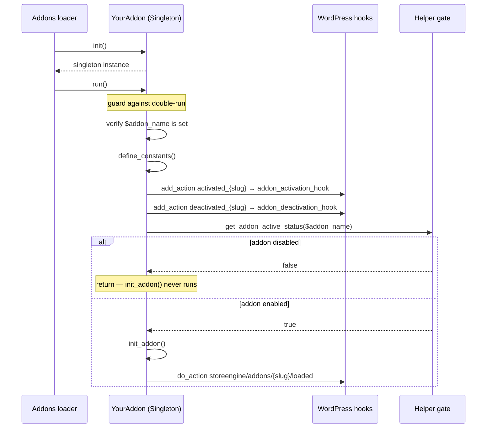

Almost every feature in StoreEngine — including core commerce features, payment gateways, SEO, affiliates, and subscriptions — ships as a **toggleable addon**. An addon is a self-contained class that boots only when the store has it enabled, so the runtime stays lean: only what a merchant turns on is loaded and only its schema is synced.

This page explains the framework: the lifecycle of an addon, the base classes and interfaces you build on, the hooks fired along the way, and how free (core) and Pro addons differ. If you want to build one, start with [Create your first addon](/addons/create-your-first-addon).

## The addon model

An addon lives in its own directory under `addons/<slug>/` with a main class that extends [`AbstractAddon`](#abstractaddon). At load time StoreEngine walks a **slug → class-name map**, registers each addon's namespace with the autoloader, and calls `init()->run()` on the main class. `run()` is the single orchestration point: it wires activation hooks, checks whether the addon is enabled, and — only if it is — boots the addon's code.

The key design properties:

- **Opt-in runtime.** `init_addon()` (where you register hooks, REST routes, admin menus, and so on) runs *only* when the addon is active. A disabled addon costs one autoload registration and nothing more.
- **Slug-driven.** The `$addon_name` slug is the identity used everywhere: the active-status option key, the dynamic hook names, and the schema-version map. It must be unique and redeclared by every addon.
- **Singleton.** Every addon is a singleton (via the `Singleton` trait), so `init()` always returns the same instance.
- **Central schema syncing.** Addons that own custom tables declare a version string; a single manager reruns their installer when the version changes. No per-addon `init` hook required. See [Database tables](/addons/database-tables).

## Lifecycle of `run()`

`AbstractAddon::run()` is `final` — you never override it. It runs once per request for each registered addon and does the following:

Step by step:

1. **Double-run guard.** If `run()` already executed on this instance it returns immediately.
2. **Slug check.** If `$addon_name` is empty, StoreEngine calls `_doing_it_wrong()` and bails — a missing slug is a programming error.
3. **`define_constants()`.** Always called, even when the addon is disabled, so constants like version and paths are available.
4. **Activation/deactivation wiring.** `run()` binds `storeengine/addons/activated_{$addon_name}` to your `addon_activation_hook()` and the matching `deactivated_` hook to `addon_deactivation_hook()`. These are wired *regardless of active status* so a toggle can fire them.
5. **The gate.** `Helper::get_addon_active_status($this->addon_name)` decides whether to continue. If the addon is off, `run()` returns here.
6. **`init_addon()`.** Your boot method — register hooks, load subsystems, add menus. Runs only when active.
7. **Loaded hook.** `do_action("storeengine/addons/{$addon_name}/loaded")` fires so other code can react to this specific addon being ready.

:::note
Because `define_constants()` and the activation wiring happen before the gate, an addon can define its constants and respond to being toggled on even during the request where it was still disabled.
:::

## Base classes and interfaces

Four types make up the framework — two for the addon itself, two for its settings.

### `AddonInterface`

`StoreEngine\Interfaces\AddonInterface` (`includes/interfaces/addon-interface.php`) is the contract every addon fulfills.

| Method | Purpose |
| --- | --- |
| `init()` *(static)* | Return the addon singleton. Provided by the `Singleton` trait. |
| `define_constants()` | Define version, path, and other constants. Always called. |
| `init_addon()` | Boot the addon — register hooks, routes, menus. Runs only when active. |
| `addon_activation_hook()` | Fires once when the addon is switched on. |
| `addon_deactivation_hook()` | Fires once when the addon is switched off. |
| `get_db_version(): string` | Schema version of the addon's own tables. Empty string = no tables. |
| `install_tables(): void` | Idempotent `dbDelta` calls to (re)create the addon's tables. |

### `AbstractAddon`

`StoreEngine\Classes\AbstractAddon` (`includes/classes/abstract-addon.php`) implements `AddonInterface` and gives you sensible defaults so a minimal addon overrides very little.

| Member | Role |
| --- | --- |
| `protected string $addon_name` | **You must redeclare this.** The unique slug used for gating, hooks, and schema. Missing → `_doing_it_wrong`. |
| `final public function run()` | The orchestration described above. Not overridable. |
| `addon_activation_hook()` / `addon_deactivation_hook()` | Default no-ops; override when you need setup/teardown. |
| `get_db_version(): string` | Returns `''` by default (no tables). |
| `install_tables(): void` | No-op by default. |
| `__construct()` | `protected` — instantiate only through `init()`. |
| `__clone()` / `__wakeup()` | Forbidden; both call `_doing_it_wrong`. |

The `Singleton` trait (`use Singleton;`) supplies `init()` and `get_instance()`. Every addon must declare `use Singleton;` and redeclare `$addon_name`.

### `AddonSettingsInterface` and `AbstractAddonSettings`

Addons that expose settings implement `StoreEngine\Interfaces\AddonSettingsInterface` through `StoreEngine\Classes\AbstractAddonSettings`. This auto-wires your defaults and field definitions into the admin Settings UI and gives you a typed reader. See [Settings API](/addons/settings-api) for the full treatment.

| Type | Role |
| --- | --- |
| `AddonSettingsInterface` | Contract: `get_default_settings()`, `get_settings_fields()`, `save_default_settings()`. |
| `AbstractAddonSettings` | Base class providing `get_settings()`, `load_settings()`, save/validation plumbing, and admin-UI filter wiring. |

## Hooks an addon relies on

| Hook | Type | Fires |
| --- | --- | --- |
| `storeengine/addons/{slug}/loaded` | action | After a specific active addon's `init_addon()` runs. |
| `storeengine/addons/loaded` | action | After *all* addons have been loaded this request. |
| `storeengine/addons/activated_{slug}` | action | When the addon is switched on (also drives `addon_activation_hook`). |
| `storeengine/addons/deactivated_{slug}` | action | When the addon is switched off (also drives `addon_deactivation_hook`). |
| `storeengine/addons/loader_args` | filter | The slug → class-name map of core addons. |
| `storeengine/addons/dependencies` | filter | Inter-addon dependency map. See [Dependencies](/addons/dependencies). |
| `storeengine/admin/settings_default_data` | filter | Auto-wired by `AbstractAddonSettings` to merge your defaults. |
| `storeengine/ajax/settings_fields` | filter | Auto-wired to merge your field definitions. |

## Core vs Pro addons

Free and Pro addons use the same base classes and the same lifecycle. The differences are in how they are registered and gated:

| | Core (free) addon | Pro addon |
| --- | --- | --- |
| Lives in | `storeengine/addons/<slug>/` | `storeengine-pro/addons/<slug>/` |
| Registered via | `storeengine/addons/loader_args` filter | `storeengine_pro/addons/loader_args` filter |
| Namespace | `StoreEngine\Addons\<Class>` | `StoreEnginePro\Addons\<Class>` |
| Schema syncing | `Addons::sync_addon_schemas()` | Reuses `\StoreEngine\Addons::sync_schema_for()` |
| Gate | `Helper::get_addon_active_status($slug)` | `Helper::get_addon_active_status($slug, true)` — also requires active Pro |

The Pro loader mirrors the core loader but writes into the same `storeengine_addons_db_version` option through the shared, reusable `sync_schema_for()` method, so both plugins keep their schema versions in one place. Passing `true` as the second argument to `get_addon_active_status()` adds an "is Pro active" requirement on top of the addon's own toggle — see [Registration and gating](/addons/registration-and-gating).

## Where to go next

- [Create your first addon](/addons/create-your-first-addon) — a copy-pasteable end-to-end tutorial.
- [Settings API](/addons/settings-api) — expose settings that appear in the admin UI.
- [Database tables](/addons/database-tables) — own custom tables with versioned installers.
- [Registration and gating](/addons/registration-and-gating) — the loader pipeline and active-status checks.
- [Dependencies](/addons/dependencies) — require other addons or plugins.
