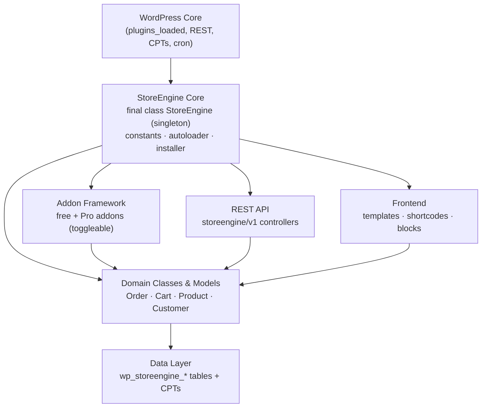

StoreEngine is layered: a small bootstrap boots the engine, an addon framework loads features on demand, a PSR-4 autoloader wires up classes, and everything sits on a custom-table data layer with a REST API, hooks system, and a template-driven frontend. This page explains each layer and how they connect.

## The layers



## Bootstrap: the `StoreEngine` singleton

The main file `storeengine.php` defines a `final class StoreEngine` singleton. Its constructor drives startup in a deliberate order:

1. **Define constants** — paths, URLs, version, and table names.
2. **Load dependencies** — pull in the [autoloader](#psr-4-autoloading) and Composer's vendor autoload. If core files are missing (e.g. an interrupted update), it bails with an admin notice rather than fataling.
3. **Register lifecycle hooks** — `register_activation_hook`, `register_deactivation_hook`, and a shutdown error logger.
4. **Boot settings and installer** — `Settings::load_settings()` and `StoreEngine\Installer::init()` create/upgrade tables and register options.
5. **Initialize subsystems** on WordPress hooks — addons, REST API, admin, AJAX, frontend, hooks, integrations, schedules, shortcodes, and blocks.

```php
final class StoreEngine {
    protected static ?StoreEngine $instance = null;

    public ?Customer $customer = null;
    public ?Cart $cart = null;
    // …
}
```

The singleton is the composition root: it is the object other subsystems reach for the current cart, customer, and shared services.

## The addon framework

The defining architectural choice: **core features and commerce features ship as addons that can be toggled**. Payment gateways (Stripe, PayPal, Razorpay, Paddle), subscriptions, memberships, affiliates, multi-currency, invoicing, and more are all addons living under `addons/`.

`\StoreEngine\Addons` loads them. Its `addons_loader()` reads a slug → class map through the `storeengine/addons/loader_args` filter, then for each addon:

- registers the addon's namespace and directory with the autoloader,
- initializes the addon's main class (which extends `\StoreEngine\Classes\AbstractAddon`) and calls `run()`,
- tracks active addons so their schema is kept in sync.

Only **active** addons participate in schema syncing. Every addon declares a `get_db_version()`; the manager compares it against the single `storeengine_addons_db_version` option and reruns `install_tables()` on a mismatch — no per-addon option or bespoke upgrade hook required.

:::tip[Extending the addon roster]
Because the addon map runs through `storeengine/addons/loader_args`, a third-party plugin can register its own addon into StoreEngine's framework by filtering that array. See [Building Addons](/addons/architecture).
:::

Pro reuses this exact machinery via its own `storeengine_pro/addons/loader_args` filter and shares the core's `\StoreEngine\Addons::sync_schema_for()`. See [Free vs Pro](/getting-started/free-vs-pro).

## PSR-4 autoloading

Classes load through `includes/autoload.php` (`StoreEngine\Autoload`), a lightweight PSR-4 resolver kept as a singleton via `Autoload::get_instance()`. It maps namespaces to directories:

```php
private array $autoload_directories = [
    'StoreEngine'                  => STOREENGINE_ROOT_DIR_PATH . 'includes/',
    'StoreEngine\Payment\Gateways' => STOREENGINE_INCLUDES_DIR_PATH . 'payment-gateways/',
];
```

Class names are transformed to lowercase, hyphenated file paths (e.g. `StoreEngine\Classes\Cart` → `includes/classes/cart.php`). Addons extend the map at runtime:

```php
Autoload::get_instance()->add_namespace_directory(
    'StoreEnginePro\\Addons\\Subscription',
    STOREENGINE_PRO_ADDONS_DIR_PATH . 'subscription/'
);
```

Third-party Composer packages are vendored and **Strauss-prefixed** to avoid collisions with other plugins, loaded via Composer's own autoloader.

## Data layer: custom tables + CPTs

StoreEngine splits persistence by access pattern:

- **Custom tables** (`wp_storeengine_*`) back high-volume, relational data — orders, order items, order meta, addresses, carts, subscriptions, payment tokens, product prices/variations, shipping zones, and more. Schemas live as `create-*.php` files under `includes/database/`.
- **Custom post types** back editable catalog entities — `storeengine_product` and `storeengine_coupon` — so they use the standard WordPress editor and taxonomy machinery.

Domain **classes** (`includes/classes/`) and **models** (`includes/models/`) provide the object API over this storage. Read and write orders through these, never through `WP_Query`.

:::warning
Orders and subscriptions are rows in `storeengine_orders`, discriminated by a `type` column. Treat post-based order queries from other plugins as inapplicable here. See [Data & Objects](/data/orders).
:::

## REST API

The REST layer (`includes/api/`, bootstrapped by `\StoreEngine\API`) registers controllers under the **`storeengine/v1`** namespace — cart, checkout, orders, products, customers, payments, payment methods, settings, shipping, coupons, analytics, and storefront auth, among others. It powers the admin React app, the storefront, and external integrations alike. See [REST API](/rest-api/overview).

## Hooks system

StoreEngine exposes an extensive set of **actions and filters** namespaced under `storeengine/…`. Addons and integrations hook the commerce lifecycle — cart changes, checkout, order status transitions, payments — to add behavior without patching core. The addon loader map itself (`storeengine/addons/loader_args`) is a filter. See [Actions](/reference/hooks/actions) and [Filters](/reference/hooks/filters).

## Frontend

The storefront is rendered through three cooperating mechanisms:

- **Templates** — PHP partials in `templates/`, overridable from a theme at `yourtheme/storeengine/{template}.php`. See [Templates](/reference/templates).
- **Shortcodes** — `includes/shortcode/` renders store surfaces (checkout, account, product listings) that can be dropped into any page.
- **Blocks** — `includes/blocks/` bridges shortcodes into Gutenberg blocks so the same surfaces are available in the block editor.

## Where to go next

- [Plugin Structure](/getting-started/plugin-structure) — an annotated map of the directories referenced above.
- [Building Addons](/addons/architecture) — apply the addon framework in practice.
- [Data & Objects](/data/orders) — the domain object API over the data layer.
